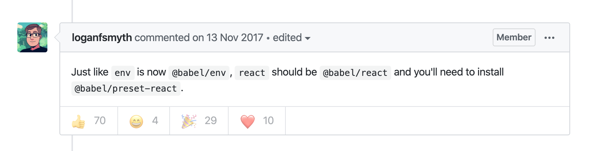
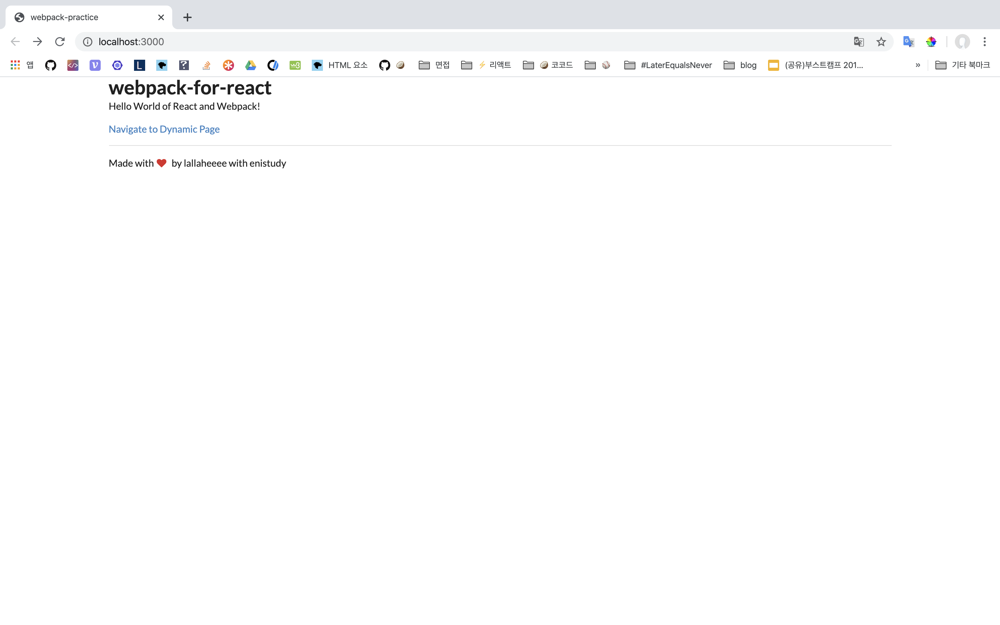

[깊이있는 리액트 개발환경 구성하기](https://sujinlee.me/webpack-react-tutorial/) 을 따라하며, 마주친 에러들을 기록했다.
<br>

### ⚠️ You may need an appropriate loader to handle this file type, currently no loaders are configured to process this file

```zsh
ERROR in ./src/index.js 8:2
Module parse failed: Unexpected token (8:2)
You may need an appropriate loader to handle this file type, currently no loaders are configured to process this file. See https://webpack.js.org/concepts#loaders
| const App = () => {
|       return (
>               <Router>
|                       <Switch>
|                               <Route exact path="/" component={Home} />
 @ multi @babel/polyfill ./src/index.js main[1]
Child html-webpack-plugin for "index.html":

```

```zsh
ERROR in ./src/index.js
Module build failed (from ./node_modules/babel-loader/lib/index.js):
Error: Cannot find module 'babel-preset-react' from '/Users/lallaheeee/dev/web/lallaheeee-webpack-practice'
- If you want to resolve "react", use "module:react"
    at Function.module.exports [as sync] 
```

`./src/index.js` 를 시작으로 번들을 진행하려고 하는데, 알 수 없는 문법이 나와 발생한 에러이다. 
웹팩에서 리액트의 `jsx` 문법을 트랜스파일하기 위해서는 [babel-loader](https://github.com/babel/babel-loader) 가 필요하다.

```zsh
$ yarn add babel-preset-react -D  
// OR
$ yarn add @babel/preset-react -D 	//babel 7 이후
```

`./babelrc` 파일에 해당 preset 옵션을 추가를 하거나, `webpack.config.js` 에서 babel-loader에 옵션을 추가할 수 있다 

```js
//./babelrc
{
  "presets": ["@babel/preset-env", "@babel/preset-react"]
}

```

```js
// webpack.config.js
module: {
  rules: [
    {
      test: /\.m?js$/,
      exclude: /(node_modules|bower_components)/,
      use: {
        loader: 'babel-loader',
        options: {
          presets: ['@babel/preset-env']
        }
      }
    }
  ]
}
```

<br> <br>

### ⚠️  Plugin/Preset files are not allowed to export objects, only functions.

```zsh
ERROR in ./src/index.js
Module build failed (from ./node_modules/babel-loader/lib/index.js):
Error: Plugin/Preset files are not allowed to export objects, only functions.
```



[여기](https://github.com/babel/babel/issues/6808) 를 참고해 해결했다. 

<br>

###  ❓ babel-preset- VS @babel/preset-

```js
⭕️ "presets": ["@babel/preset-env", "@babel/preset-react"]
```

```js
❌ "presets": ["env", "react"],
```

[Upgrade to Babel 7](https://babeljs.io/docs/en/v7-migration)

바벨 7로 업데이트되면서 기존에 분산되된 패키지들을 `babel-` 네임스페이스 `@babel` 로 모아주면서 발생한 에러였다. 

<br> <br>

### ⚠️ CSS Loader has been initialised using an options object that does not match the API schema.

```zsh
ERROR in ./src/components/layout.css (./node_modules/css-loader/dist/cjs.js??ref--5-1!./src/components/layout.css)
Module build failed (from ./node_modules/css-loader/dist/cjs.js):
ValidationError: Invalid options object. CSS Loader has been initialised using an options object that does not match the API schema.
 - options has an unknown property 'camelCase'. These properties are valid:
   object { url?, import?, modules?, sourceMap?, importLoaders?, localsConvention?, onlyLocals?, esModule? }
```

`css-loader` 에 포함된 `options` 중  `camelCase`가 사라져서 발생하는 에러였다. 따라하던 [깊이있는 리액트 개발환경 구성하기](https://sujinlee.me/webpack-react-tutorial/) 가 2년이 지난 글이라, 시간이 지나면서 해당 부분이 업데이트되었다. 
[여기](https://webpack.js.org/loaders/css-loader/#root) 서 css-loader의 옵션들을 볼 수 있었다. 
`camelCase: true` 는 `localsConvention:"camelCase"` 로 대체되었다. 

```js
module: {
	rules: [
	...
	{
		test: /\.css$/,
		use: [
			{ loader: 'style-loader' },
			{
			  loader: 'css-loader',
			  options: {
					modules: true,
					camelCase: true,
					sourceMap: true
				    }
			}
		]
	}
```

그냥 지워버렸다. 

```js
{
	test: /\.css$/,
	use: ['style-loader', 'css-loader']
}
```


동작한다! 



<br> <br>

### ⚠️ .babelrc preset 에러! 

```zsh
ERROR in ./src/index.js
Module build failed (from ./node_modules/babel-loader/lib/index.js):
SyntaxError: /Users/lallaheeee/dev/web/lallaheeee-webpack-practice/.babelrc: Error while parsing config - JSON5: invalid character 'm' at 5:3
```

[참고](https://github.com/babel/babel-loader/issues/521)

```js
{
	"presets": [ "@babel/preset-env", { "modules": false },
		"@babel/preset-react" ],
	"plugins": ["react-hot-loader/babel"]
}
```

을 다음과 같이 변경했다. 

```js
{
	"presets": [
		[ "@babel/preset-env", { "modules": false } ],
		"@babel/preset-react"
	],
	"plugins": ["react-hot-loader/babel"]
}
```


